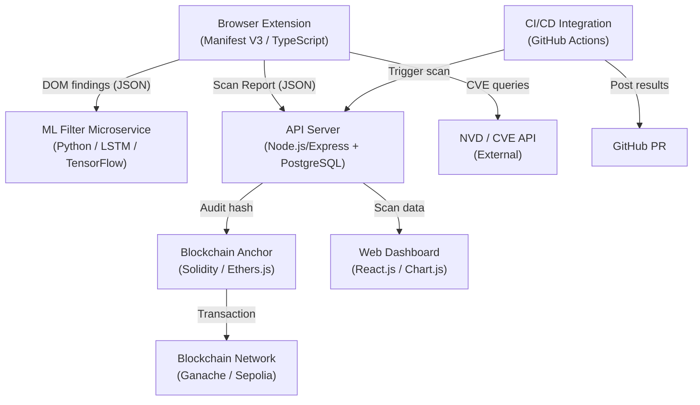

# Design Document: Vylnt (DevGuard)

## Overview

Vylnt (DevGuard) is a multi-layered developer security platform that provides continuous, automated security feedback during development. It combines passive browser-side scanning, ML-based noise reduction, immutable blockchain audit trails, a web dashboard for visibility, and CI/CD integration for enforcement.

The system is composed of five loosely coupled layers that communicate via well-defined interfaces:

1. **Browser Extension** — passive scanner running in the browser (Manifest V3, TypeScript)
2. **ML Filter Microservice** — LSTM-based classifier that suppresses false positives (Python, TensorFlow)
3. **Blockchain Audit Layer** — SHA-256 hashes of scan reports anchored on-chain (Solidity, Ethers.js)
4. **Web Dashboard + API Server** — React.js frontend and Node.js/Express backend with JWT auth and PostgreSQL
5. **CI/CD Integration** — GitHub Actions workflow that triggers scans on PRs and enforces merge policies

### Design Goals

- **Non-intrusive**: The scanner must never modify or block page execution
- **Resilient**: Each layer degrades gracefully when dependencies are unavailable
- **Auditable**: Every scan report is cryptographically anchored and verifiable
- **Extensible**: New scan checks can be added without changing the report schema contract
- **Privacy-preserving**: Only findings metadata is transmitted; no page content or form data leaves the browser

---

## Architecture

### High-Level System Diagram



### Data Flow

1. The Extension intercepts HTTP responses and DOM events passively
2. DOM findings are sent to the ML Filter for classification before inclusion in the report
3. The completed Scan Report is submitted to the API Server
4. The API Server persists the report and triggers blockchain anchoring
5. The Dashboard reads from the API Server to display findings and trends
6. On PRs, the CI/CD workflow triggers a scan via the API Server and enforces merge policies

### Deployment Topology

| Component | Runtime | Deployment |
|---|---|---|
| Browser Extension | Browser (Chrome/Edge/Firefox) | Browser extension store |
| ML Filter | Python 3.11, TensorFlow | Docker container / microservice |
| API Server | Node.js 20 LTS | Docker container |
| PostgreSQL | PostgreSQL 15 | Managed DB or Docker |
| Web Dashboard | React 18 SPA | Static hosting (CDN) |
| Blockchain Anchor | Ethers.js (Node.js) | Embedded in API Server |
| Smart Contract | Solidity 0.8.x | Deployed to Ganache / Sepolia |

---

## Components and Interfaces

### 1. Browser Extension

**Responsibilities**: HTTP header inspection, cookie attribute checking, mixed content detection, DOM pattern analysis, NVD CVE lookup, report assembly, ML Filter invocation, report submission.

**Key modules**:

- `background.ts` — service worker; intercepts `webRequest` events, coordinates scanning pipeline
- `scanner/headers.ts` — inspects `Content-Security-Policy`, `Strict-Transport-Security`, `X-Frame-Options`, `X-Content-Type-Options`, `Referrer-Policy`
- `scanner/cookies.ts` — inspects `Secure`, `HttpOnly`, `SameSite` attributes
- `scanner/mixed-content.ts` — detects HTTP sub-resources on HTTPS pages via DOM traversal
- `scanner/dom-patterns.ts` — content script; detects `eval`, `innerHTML`, `document.write`, `setTimeout`/`setInterval` with string args
- `scanner/nvd-client.ts` — queries NVD API, manages 24-hour local cache (IndexedDB)
- `report/builder.ts` — assembles findings into a `ScanReport`, computes Risk Score
- `report/submitter.ts` — POSTs `ScanReport` to API Server
- `ui/popup.ts` — extension popup UI; allowlist/blocklist management, enable/disable toggle

**Timing constraints**:
- Header inspection: ≤ 500ms after response received
- Cookie inspection: ≤ 200ms after `load` event
- Mixed content detection: ≤ 1000ms after `DOMContentLoaded`
- ML Filter call: ≤ 300ms per finding (enforced by timeout)

**Cross-browser compatibility**: Uses `browser.*` namespace with a thin polyfill for Chrome's `chrome.*` namespace. Gracefully skips unsupported APIs and logs a compatibility note.

**Privacy controls**: Allowlist/blocklist stored in `browser.storage.sync`. Pages matching blocklist patterns are skipped entirely — no data transmitted.

---

### 2. ML Filter Microservice

**Responsibilities**: Classify DOM manipulation findings as `safe` or `anomalous` using an LSTM sequence model.

**Interface** (REST):

```
POST /classify
Content-Type: application/json

{
  "finding_id": "string",
  "pattern_type": "eval | innerHTML | document.write | setTimeout_string | setInterval_string",
  "context_tokens": ["string"]   // tokenized surrounding code context
}

Response 200:
{
  "finding_id": "string",
  "classification": "safe | anomalous",
  "confidence": 0.0–1.0
}
```

**Model**: Bidirectional LSTM trained on labeled DOM manipulation samples. Input: tokenized JavaScript context window (±10 tokens around the pattern). Output: binary classification + confidence score.

**Performance**: ≤ 300ms per classification at p99 under normal load.

**Fallback**: If the service returns a non-2xx response or times out, the Extension includes the finding unfiltered with a `ml_filter_status: "unavailable"` flag.

**False positive target**: < 10% FPR measured against a labeled validation set of ≥ 1,000 samples.

---

### 3. Blockchain Audit Layer

**Responsibilities**: Compute SHA-256 hashes of Scan Reports, submit them on-chain, verify stored hashes.

**Smart Contract** (`AuditAnchor.sol`):

```solidity
// SPDX-License-Identifier: MIT
pragma solidity ^0.8.0;

contract AuditAnchor {
    struct AuditRecord {
        bytes32 auditHash;
        string sessionId;
        uint256 timestamp;
        string scannedUrl;
    }

    mapping(string => AuditRecord) public records; // sessionId => record

    event AuditAnchored(string indexed sessionId, bytes32 auditHash, uint256 timestamp);

    function anchor(
        string calldata sessionId,
        bytes32 auditHash,
        string calldata scannedUrl
    ) external {
        records[sessionId] = AuditRecord(auditHash, sessionId, block.timestamp, scannedUrl);
        emit AuditAnchored(sessionId, auditHash, block.timestamp);
    }

    function verify(string calldata sessionId, bytes32 auditHash) external view returns (bool) {
        return records[sessionId].auditHash == auditHash;
    }
}
```

**Anchoring flow**:
1. API Server receives finalized Scan Report
2. Canonicalize JSON (sorted keys, no whitespace)
3. Compute `SHA-256(canonicalJson)` → `auditHash`
4. Call `anchor(sessionId, auditHash, scannedUrl)` on the contract
5. On confirmation, store `txHash` and `blockNumber` in the report metadata

**Retry policy**: On network failure, queue locally and retry at 30s, 60s, 120s with exponential backoff. After 3 failures, mark report as `unanchored`.

**Networks**: Configurable — Ganache (local dev), Ethereum Sepolia testnet, or Polygon Mumbai testnet.

---

### 4. API Server

**Responsibilities**: Receive and validate Scan Reports, persist to PostgreSQL, serve paginated data to Dashboard, authenticate via JWT, trigger blockchain anchoring.

**Technology**: Node.js 20 + Express 4, PostgreSQL 15, `ajv` for JSON Schema validation, `jsonwebtoken` for JWT.

**REST Endpoints**:

| Method | Path | Auth | Description |
|---|---|---|---|
| `POST` | `/api/v1/reports` | JWT | Submit a Scan Report |
| `GET` | `/api/v1/reports` | JWT | List paginated reports for user |
| `GET` | `/api/v1/reports/:sessionId` | JWT | Get a single report |
| `GET` | `/api/v1/reports/:sessionId/verify` | JWT | Verify blockchain anchor |
| `POST` | `/api/v1/auth/login` | None | Obtain JWT token |
| `GET` | `/api/v1/health` | None | Health check |

**Validation**: Incoming reports are validated against the versioned `ScanReport` JSON Schema using `ajv`. Invalid reports return HTTP 400 with a structured error body.

**Authentication**: All `/api/v1/reports` endpoints require a valid JWT in the `Authorization: Bearer <token>` header. Invalid/missing tokens return HTTP 401.

**Performance**: Read endpoints respond within 500ms under 100 concurrent requests. PostgreSQL indexes on `(user_id, timestamp DESC)` and `session_id`.

**Error handling**: DB unavailable → HTTP 503 + log with `session_id`. Schema invalid → HTTP 400 + validation error details.

---

### 5. Web Dashboard

**Responsibilities**: Display scan history, findings, risk score trends, vulnerability breakdowns, and blockchain anchor status.

**Technology**: React 18, React Router, Chart.js, Axios.

**Key views**:

- **Report List** — paginated table of Scan Reports sorted by timestamp descending
- **Report Detail** — full findings list, Risk Score, scanned URL, timestamp, anchor status
- **Risk Trend Chart** — line chart of Risk Score over time for a selected URL/domain (last 30+ sessions)
- **Severity Breakdown Chart** — bar/donut chart of findings grouped by severity
- **Settings** — allowlist/blocklist management (synced with extension via API)

**Filtering**: Client-side severity filter updates the displayed findings list within 200ms without a full page reload (React state update, no network call).

**Security**: Served over HTTPS. All API calls include JWT. Unauthenticated users are redirected to login.

---

### 6. CI/CD Integration

**Responsibilities**: Trigger scans on PRs, post findings summaries as PR comments, enforce merge policies.

**Technology**: GitHub Actions YAML workflow, custom action or shell script calling the API Server.

**Workflow trigger**: `pull_request` events (`opened`, `synchronize`, `reopened`).

**Steps**:
1. Build the web application under test
2. Start a local server or deploy to a staging URL
3. POST a scan request to the API Server with the staging URL
4. Poll for scan completion (timeout: 10 minutes)
5. Retrieve the Scan Report
6. Post a PR comment with Risk Score, severity counts, and dashboard link
7. Set check status: `failed` if any Critical Vulnerabilities found, `passed` otherwise
8. If scan service unreachable: set check status to `failed` with "scan service unavailable" message

---

## Data Models

### ScanReport (JSON Schema v1)

```json
{
  "$schema": "http://json-schema.org/draft-07/schema#",
  "$id": "https://vylnt.dev/schemas/scan-report/v1",
  "type": "object",
  "required": ["schemaVersion", "sessionId", "timestamp", "scannedUrl", "browserInfo", "findings", "riskScore", "mlFilterStatus"],
  "properties": {
    "schemaVersion": { "type": "string", "const": "1.0" },
    "sessionId": { "type": "string", "format": "uuid" },
    "timestamp": { "type": "string", "format": "date-time" },
    "scannedUrl": { "type": "string", "format": "uri" },
    "browserInfo": {
      "type": "object",
      "required": ["name", "version", "extensionVersion"],
      "properties": {
        "name": { "type": "string" },
        "version": { "type": "string" },
        "extensionVersion": { "type": "string" }
      }
    },
    "findings": {
      "type": "array",
      "items": { "$ref": "#/definitions/Finding" }
    },
    "riskScore": { "type": "number", "minimum": 0, "maximum": 100 },
    "mlFilterStatus": {
      "type": "string",
      "enum": ["applied", "unavailable", "not_applicable"]
    },
    "blockchainAnchor": {
      "type": "object",
      "properties": {
        "status": { "type": "string", "enum": ["anchored", "pending", "unanchored"] },
        "txHash": { "type": "string" },
        "blockNumber": { "type": "integer" },
        "auditHash": { "type": "string" }
      }
    }
  },
  "definitions": {
    "Finding": {
      "type": "object",
      "required": ["findingId", "type", "severity", "description", "affectedResource"],
      "properties": {
        "findingId": { "type": "string", "format": "uuid" },
        "type": {
          "type": "string",
          "enum": ["missing_header", "misconfigured_header", "insecure_cookie", "mixed_content", "dom_pattern", "cve", "note"]
        },
        "severity": {
          "type": "string",
          "enum": ["critical", "high", "medium", "low", "informational"]
        },
        "description": { "type": "string" },
        "affectedResource": { "type": "string" },
        "details": { "type": "object" },
        "mlConfidence": { "type": "number", "minimum": 0, "maximum": 1 }
      }
    }
  }
}
```

### PostgreSQL Schema

```sql
-- Users
CREATE TABLE users (
    id UUID PRIMARY KEY DEFAULT gen_random_uuid(),
    email TEXT UNIQUE NOT NULL,
    password_hash TEXT NOT NULL,
    created_at TIMESTAMPTZ DEFAULT NOW()
);

-- Scan Reports
CREATE TABLE scan_reports (
    session_id UUID PRIMARY KEY,
    user_id UUID REFERENCES users(id) ON DELETE CASCADE,
    schema_version TEXT NOT NULL,
    timestamp TIMESTAMPTZ NOT NULL,
    scanned_url TEXT NOT NULL,
    risk_score NUMERIC(5,2) NOT NULL CHECK (risk_score >= 0 AND risk_score <= 100),
    ml_filter_status TEXT NOT NULL,
    blockchain_status TEXT NOT NULL DEFAULT 'pending',
    tx_hash TEXT,
    block_number BIGINT,
    audit_hash TEXT,
    raw_report JSONB NOT NULL,
    created_at TIMESTAMPTZ DEFAULT NOW()
);

CREATE INDEX idx_scan_reports_user_timestamp ON scan_reports (user_id, timestamp DESC);
CREATE INDEX idx_scan_reports_scanned_url ON scan_reports (scanned_url);

-- Findings (denormalized for query performance)
CREATE TABLE findings (
    finding_id UUID PRIMARY KEY,
    session_id UUID REFERENCES scan_reports(session_id) ON DELETE CASCADE,
    type TEXT NOT NULL,
    severity TEXT NOT NULL,
    description TEXT NOT NULL,
    affected_resource TEXT NOT NULL,
    details JSONB,
    ml_confidence NUMERIC(4,3)
);

CREATE INDEX idx_findings_session ON findings (session_id);
CREATE INDEX idx_findings_severity ON findings (severity);

-- Blockchain retry queue
CREATE TABLE anchor_queue (
    id SERIAL PRIMARY KEY,
    session_id UUID REFERENCES scan_reports(session_id),
    audit_hash TEXT NOT NULL,
    attempts INTEGER DEFAULT 0,
    next_retry_at TIMESTAMPTZ,
    created_at TIMESTAMPTZ DEFAULT NOW()
);
```

### Risk Score Computation

The Risk Score (0–100) is computed as a weighted sum of findings by severity, capped at 100:

```
weights = { critical: 40, high: 15, medium: 5, low: 2, informational: 0.5 }
raw_score = sum(weight[severity] * count[severity] for each severity)
risk_score = min(100, raw_score)
```

### ML Filter Request/Response

```typescript
interface MLFilterRequest {
  finding_id: string;
  pattern_type: "eval" | "innerHTML" | "document.write" | "setTimeout_string" | "setInterval_string";
  context_tokens: string[];
}

interface MLFilterResponse {
  finding_id: string;
  classification: "safe" | "anomalous";
  confidence: number; // 0.0–1.0
}
```

---

## Correctness Properties

*A property is a characteristic or behavior that should hold true across all valid executions of a system — essentially, a formal statement about what the system should do. Properties serve as the bridge between human-readable specifications and machine-verifiable correctness guarantees.*

---

### Property 1: Header finding completeness

*For any* HTTP response missing one or more required security headers (`Content-Security-Policy`, `Strict-Transport-Security`, `X-Frame-Options`, `X-Content-Type-Options`, `Referrer-Policy`), the scanner SHALL produce a finding for each missing or misconfigured header, and each finding SHALL contain the header name, severity level, and affected URL. For misconfigured headers, the finding SHALL additionally contain the detected value and the expected value.

**Validates: Requirements 1.1, 1.2, 1.3**

---

### Property 2: Scanner error resilience

*For any* error-inducing header input (malformed values, null headers, unexpected types), the scanner SHALL log the error with the affected URL and SHALL NOT throw an unhandled exception or halt processing of subsequent requests.

**Validates: Requirements 1.5**

---

### Property 3: Cookie finding completeness

*For any* cookie missing one or more of the `Secure`, `HttpOnly`, or `SameSite` attributes (or having `SameSite=None` without `Secure`), the scanner SHALL produce a finding containing the cookie name and the specific missing or misconfigured attribute(s).

**Validates: Requirements 2.1, 2.2, 2.3, 2.4**

---

### Property 4: Mixed content finding completeness

*For any* HTTP sub-resource (script, stylesheet, image, iframe, media) or form with an HTTP action URL loaded on an HTTPS page, the scanner SHALL produce a finding containing the resource URL, resource type, and severity level.

**Validates: Requirements 3.1, 3.2**

---

### Property 5: DOM pattern finding completeness

*For any* dangerous DOM manipulation pattern (`eval`, `innerHTML`, `document.write`, `setTimeout`/`setInterval` with string arguments) detected in a page's JavaScript, the scanner SHALL produce a finding containing the pattern type, script source URL or inline identifier, and line number where available.

**Validates: Requirements 4.1**

---

### Property 6: DOM pattern aggregation

*For any* page where more than 20 instances of the same dangerous pattern are detected, the scanner SHALL produce exactly one aggregated finding for that pattern type containing the total count, rather than N individual findings.

**Validates: Requirements 4.3**

---

### Property 7: CVE finding completeness

*For any* third-party JavaScript library detected with a known version and one or more associated CVEs, the scanner SHALL produce a finding containing the library name, detected version, CVE identifiers, CVSS scores, and a link to the CVE detail page.

**Validates: Requirements 5.2**

---

### Property 8: NVD cache hit prevents redundant API calls

*For any* library name and version that has been queried within the last 24 hours, a subsequent query for the same library SHALL use the cached result and SHALL NOT make a new API call to the NVD service.

**Validates: Requirements 5.3**

---

### Property 9: ML Filter classification applied to all DOM findings

*For any* set of DOM-level JavaScript findings produced by the scanner, each finding SHALL be sent to the ML Filter for classification before the Scan Report is assembled. Findings classified as `safe` SHALL be excluded from the report. Findings classified as `anomalous` SHALL be included in the report with the ML Filter's confidence score attached.

**Validates: Requirements 6.1, 6.2, 6.3**

---

### Property 10: Scan Report structural invariants

*For any* completed scan session, the produced Scan Report SHALL:
- Contain a unique UUID v4 session ID not shared with any other report
- Contain a `schemaVersion` field that is non-empty
- Contain a `riskScore` value in the range [0, 100]
- Contain all required fields: `sessionId`, `timestamp`, `scannedUrl`, `browserInfo`, `findings`, `riskScore`, `mlFilterStatus`

**Validates: Requirements 7.1, 7.2, 7.3, 7.4**

---

### Property 11: Scan Report serialization round-trip

*For any* valid Scan Report object, serializing it to JSON and then deserializing it SHALL produce an object that is deeply equal to the original Scan Report.

**Validates: Requirements 7.5**

---

### Property 12: Audit hash correctness

*For any* Scan Report, the SHA-256 hash computed by the Blockchain Anchor SHALL equal the SHA-256 hash of the canonical JSON representation (sorted keys, no whitespace) of that report.

**Validates: Requirements 8.1**

---

### Property 13: Blockchain anchor verification round-trip

*For any* Scan Report that has been successfully anchored on-chain, calling `verify(sessionId, auditHash)` with the original report's hash SHALL return `true`. Calling `verify(sessionId, modifiedHash)` with any hash that differs from the stored hash SHALL return `false`.

**Validates: Requirements 8.5**

---

### Property 14: Report list sort order

*For any* set of Scan Reports belonging to an authenticated user, the list returned by the API Server and rendered by the Dashboard SHALL be sorted by timestamp in strictly descending order (most recent first).

**Validates: Requirements 9.1**

---

### Property 15: Report detail completeness

*For any* Scan Report selected in the Dashboard, the detail view SHALL render all of: the full findings list, Risk Score, scanned URL, timestamp, and blockchain anchor status.

**Validates: Requirements 9.2**

---

### Property 16: Severity grouping correctness

*For any* set of findings with varying severities, the vulnerability breakdown chart data SHALL correctly group findings by severity and the count for each severity SHALL equal the number of findings with that severity. When a severity filter is applied, the filtered findings list SHALL contain only findings whose severity matches the selected filter.

**Validates: Requirements 9.4, 9.5**

---

### Property 17: Invalid report rejection

*For any* Scan Report submission that fails JSON Schema validation (missing required fields, wrong types, out-of-range values), the API Server SHALL return an HTTP 400 response containing a descriptive error message that identifies the specific validation failure.

**Validates: Requirements 10.2**

---

### Property 18: JWT authentication enforcement

*For any* request to a protected API endpoint that lacks a valid JWT token (missing, expired, malformed, or invalid signature), the API Server SHALL return an HTTP 401 response and SHALL NOT return any scan data.

**Validates: Requirements 10.4**

---

### Property 19: CI/CD check status correctness

*For any* completed scan result, the CI/CD integration SHALL set the GitHub check status to `failed` if and only if the scan contains one or more Critical Vulnerabilities (CVSS ≥ 9.0 or ML-classified critical). For all other scan results (including those with high/medium/low findings but no criticals), the check status SHALL be `passed`.

**Validates: Requirements 11.3, 11.4**

---

### Property 20: PR comment completeness

*For any* completed scan, the PR comment posted by the CI/CD integration SHALL contain the Risk Score, counts of findings grouped by severity, and a link to the full Scan Report in the Dashboard.

**Validates: Requirements 11.2**

---

### Property 21: Blocklist privacy enforcement

*For any* page URL that matches a configured blocklist pattern, the scanner SHALL produce zero findings and SHALL make zero API calls to the API Server or any external service for that page.

**Validates: Requirements 13.3**

---

### Property 22: Transmitted payload privacy invariant

*For any* scan session, the data transmitted to the API Server SHALL contain only findings metadata and the scanned URL. The transmitted payload SHALL NOT contain the full page content, DOM tree, or any user-entered form data.

**Validates: Requirements 13.4**

---

## Error Handling

### Extension Layer

| Scenario | Behavior |
|---|---|
| Header inspection error | Log error with URL, continue scanning |
| ML Filter timeout/unavailable | Include all DOM findings unfiltered, set `mlFilterStatus: "unavailable"` |
| NVD API timeout (>5s) | Use cached data if available, record warning; skip CVE lookup if no cache |
| Cross-origin script access denied | Record note with script URL, skip analysis |
| API Server unreachable | Queue report locally, retry on next opportunity |
| Blocklisted URL | Skip all scanning, transmit nothing |
| Extension disabled | Immediately cease all scanning |

### API Server Layer

| Scenario | Behavior |
|---|---|
| Invalid Scan Report schema | HTTP 400 with structured validation error |
| Unauthenticated request | HTTP 401 |
| Database unavailable | HTTP 503, log error with session ID |
| Blockchain anchor failure | Queue for retry, mark report as `pending` anchor |

### Blockchain Anchor Layer

| Scenario | Behavior |
|---|---|
| Network unreachable | Queue locally, retry at 30s → 60s → 120s |
| All retries exhausted | Mark report as `unanchored`, alert operator |
| Verification mismatch | Return `false` with mismatch details |

### CI/CD Integration Layer

| Scenario | Behavior |
|---|---|
| Scan service unreachable | Set check status to `failed`, message: "scan service unavailable" |
| Scan timeout (>10 min) | Set check status to `failed`, message: "scan timed out" |
| Critical vulnerabilities found | Set check status to `failed`, block merge |
| No critical vulnerabilities | Set check status to `passed` |

---

## Testing Strategy

### Dual Testing Approach

The system uses both unit/example-based tests and property-based tests for comprehensive coverage.

**Unit tests** cover:
- Specific examples of header configurations (present, absent, misconfigured)
- Specific cookie attribute combinations
- Edge cases: HTTP pages, cross-origin scripts, version-less libraries
- Error conditions: ML Filter unavailable, NVD timeout, DB unavailable, blockchain unreachable
- Integration points: Extension → API Server, API Server → Blockchain Anchor

**Property-based tests** cover:
- Universal properties that hold across all valid inputs (Properties 1–22 above)
- Input space exploration for parsers, validators, serializers, and business logic

### Property-Based Testing Configuration

**Library choices by component**:
- Browser Extension (TypeScript): [fast-check](https://github.com/dubzzz/fast-check)
- ML Filter (Python): [Hypothesis](https://hypothesis.readthedocs.io/)
- API Server (Node.js): [fast-check](https://github.com/dubzzz/fast-check)
- Smart Contract (Solidity): [Foundry's fuzzer](https://book.getfoundry.sh/forge/fuzz-testing)

**Configuration**:
- Minimum 100 iterations per property test
- Each property test is tagged with a comment referencing the design property:
  ```
  // Feature: vylnt-devguard, Property 11: Scan Report serialization round-trip
  ```

### Test Coverage by Layer

| Layer | Unit/Example Tests | Property Tests | Integration Tests | Smoke Tests |
|---|---|---|---|---|
| Extension — Headers | ✓ | Properties 1, 2 | — | Timing (1.4) |
| Extension — Cookies | ✓ | Property 3 | — | Timing (2.5) |
| Extension — Mixed Content | ✓ | Property 4 | — | Timing (3.3) |
| Extension — DOM Patterns | ✓ | Properties 5, 6 | — | — |
| NVD Client | ✓ | Properties 7, 8 | NVD API mock | — |
| ML Filter | ✓ | Property 9 | ML service mock | FPR eval (6.6) |
| Report Builder | ✓ | Properties 10, 11 | — | — |
| Blockchain Anchor | ✓ | Properties 12, 13 | Ganache | Timing (8.6) |
| API Server | ✓ | Properties 17, 18 | DB integration | Load test (10.6) |
| Dashboard | ✓ | Properties 14–16 | — | Auth/HTTPS (9.6) |
| CI/CD Integration | ✓ | Properties 19, 20 | GitHub Actions mock | Timing (11.5) |
| Privacy Controls | ✓ | Properties 21, 22 | — | — |

### Integration Test Strategy

- **Extension → ML Filter**: Mock ML Filter service; verify classification is applied before report assembly
- **Extension → API Server**: Mock API Server; verify report is submitted with correct schema
- **API Server → PostgreSQL**: Test database; verify CRUD operations and pagination
- **API Server → Blockchain Anchor**: Mock Ethers.js; verify anchor is triggered after report persistence
- **Blockchain Anchor → Ganache**: Local Ganache instance; verify transaction submission and verification
- **CI/CD → API Server**: Mock API Server; verify scan trigger, result polling, and PR comment posting

### ML Model Evaluation

The ML Filter model is evaluated separately from runtime tests:
- Validation dataset: ≥ 1,000 labeled DOM manipulation samples
- Target: False Positive Rate < 10%
- Evaluation runs as part of the model training pipeline (not as a runtime test)
- Model artifacts are versioned and stored alongside the microservice

### Smoke Tests

Smoke tests verify one-time setup and configuration:
- Extension activates on all HTTP/HTTPS pages without additional configuration
- API Server starts and responds to `/api/v1/health`
- ML Filter microservice starts and responds to health check
- Smart contract is deployed and callable on configured network
- Dashboard is served over HTTPS
- JWT authentication rejects unauthenticated requests
